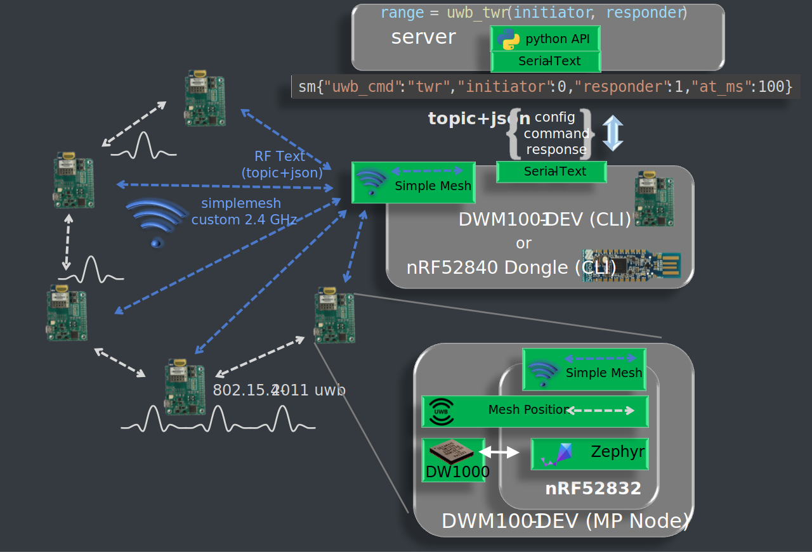

This page is showing the result of experimenting text extraction from diagrams using GPT4 Model of  [May 24 Version](https://help.openai.com/en/articles/6825453-chatgpt-release-notes)

chat

https://chat.openai.com/share/e1509df9-4f55-409e-8910-b12fbb08c033

extraction from image


```txt
Gn Me Men , initiator":@, "responder":1,"at_ms":100} |

sao topictjson ola ir:s
ae command
N
aN Mya
(topictjson) > Serial - Text
DS Testeetestelelentetntetbeteteteeie et Simple Mesh

—_~ Taye) m4
= o- oA A
custom 2.4 ih ea wv,
CoS °

1
P
r
r
1
v

> Simple Mesh

>
Mesh Position

DW1000
```
original SVG

extraction from SVG

result
```txt
'802.15.4-'
'server'
'topic+json'
'config'
'python API'
'Serial'
'Serial'
'Simple Mesh'
'nRF52832'
'Zephyr'
'DW1000'
'Simple Mesh'
'Mesh Position'
'DWM1001'
'simplemesh'
'range'
'sm{'
'nRF52840 Dongle (CLI)'
'2011 uwb'
'command'
'response'
'-'
'Text'
'DWM1001'
'-'
'DEV (CLI)'
'-'
'Text'
'-'
'DEV (MP Node)'
'custom 2.4 GHz'
'='
'uwb_twr'
'('
'initiator'
','
'responder'
')'
'"uwb_cmd"'
':'
'"twr"'
','
'"initiator"'
':0,'
'"responder"'
':1,'
'"at_ms"'
':100}'
'RF Text'
'(topic+json)'
'or'
```

This is the processed SVG with removed images


result after merging tspan
```txt
'2011 uwb'
'server'
'topic+json'
'command response'
'python API'
'- Text DWM1001 - DEV (CLI)'
'- Text'
'Simple Mesh'
'nRF52832'
'Zephyr'
'DW1000'
'Simple Mesh'
'Mesh Position'
'- DEV (MP Node)'
'custom 2.4 GHz'
'= uwb_twr ( initiator , responder )'
'"uwb_cmd" : "twr" , "initiator" :0, "responder" :1, "at_ms" :100} RF Text (topic+json)'
'or'
```
